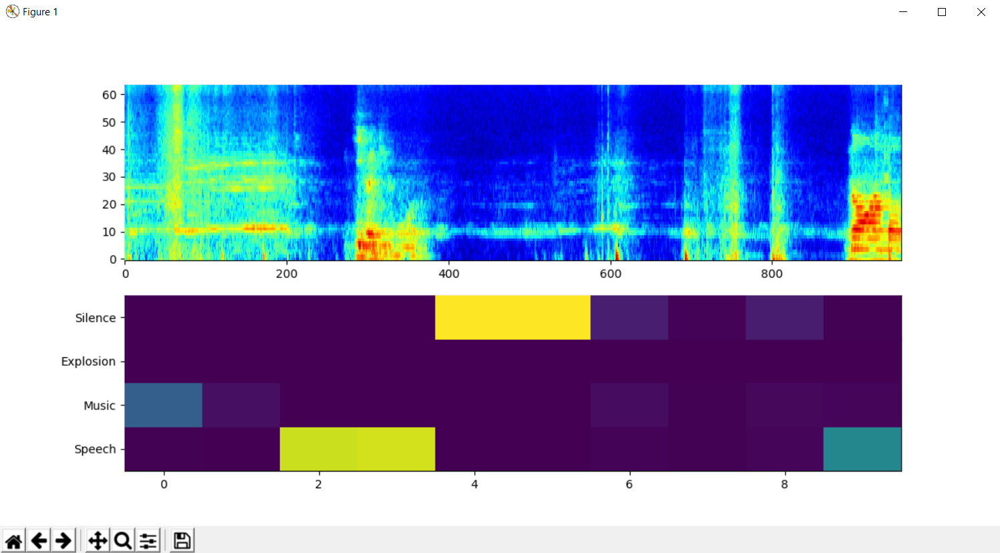

# Real-Time Sound Event Detection

This repository contains the python implementation of a Sound Event Detection system working in real time. 
This repo bases on previous work from [robertanto](https://github.com/robertanto/Real-Time-Sound-Event-Detection)



## Getting started

Execute the following commands to setup you project.

```bash 
git clone https://github.com/moritzgeiger/real-time-audio-classifier.git
cd real-time-audio-classifier
pip3 install -e . 
```

At this point you have only to execute the demo by running the following command:

```bash 
audio-classifier
```

### Change the classes to detect


```bash
audio-classifier --classes 0 132 420 494 # Speech, Music, Explosion, Silence 
```

You can find the full list of 521 audio events in the [class file](./src/audio_classifier/data/yamnet_class_map.csv)
The full source of the cluster mapping is [here](https://github.com/audioset/ontology/blob/master/ontology.json)
